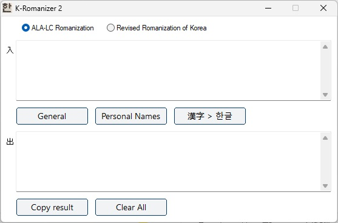

# K-Romanizer 2

[**Download Link**](https://github.com/pulibrary/K-Romanizer/releases/latest/download/K-Romanizer2.exe) (For Windows PC only)

[Download Features and Practical Guide](https://github.com/pulibrary/K-Romanizer/raw/a05e40be9ef685f9ff664e6d51792c45bcc6fe1f/Features%20and%20Practical%20Guide.pdf)

*(The program icon is custom-crafted, featuring the character* **한** *sourced directly from a facsimile of **Sŏkpo sangjŏl** and its historic **Kabinja** movable type).*

- As word division must be done manually, it is recommended that users get familiarized with the [**ALA-LC Korean Romanization**](https://www.loc.gov/catdir/cpso/romanization/korean.pdf) before using K-Romanizer 2. Otherwise, inaccurate results may occur.

- K-Romanizer 2 also supports **[Revised Romanization of Korean](https://korean.go.kr/kornorms/regltn/regltnView.do?regltn_code=0004#a)** (한국어 로마자 표기법), which is the official romanization standard in the Republic of Korea.

### License
K-Romanizer 2 was developed by [Hyoungbae Lee](https://library.princeton.edu/about/staff-directory/hyoungbae-lee) (Korean Studies Librarian, Princeton University) and is licensed under a [Creative Commons Attribution-NonCommercial-NoDerivatives 4.0 International License](https://creativecommons.org/licenses/by-nc-nd/4.0/).

### Troubleshooting
K-Romanizer 2 is digitally signed by the Trustees of Princeton University. If Windows gives a virus warning, which is a false positive, please consult local IT staff in order to add the K-Romanizer2.exe file to the safe program list on your work PC.

### Notes
- K-Romanizer 2 is a stand-alone executable, requiring no installation.
- An internet connection is required for its dictionary file to be updated automatically.

### User Interface

What's New in K-Romanizer 2
- Redesigned modular romanization engine
- ALA-LC (North American Standard) and Revised Romanization (South Korean Standard) support
- Expanded Hancha support (~6,000 → ~20,000 characters)
- Faster long-text processing
- Automatic dictionary updates
- Excel batch processing and error reporting
- Sanskrit romanization
- Optional AI-assisted Korean word division and Japanese romanization
